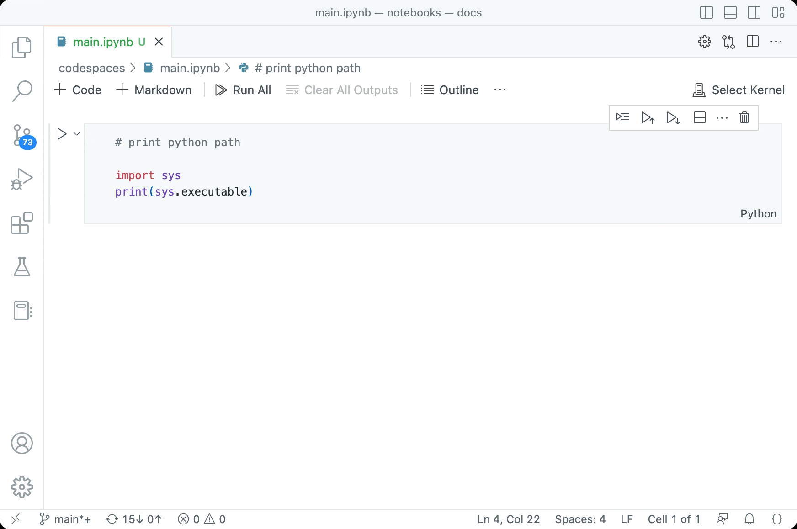

# Codespaces Instructions

### How to Create a Jupyter Notebook
Before you start coding, you need to create a file in which to write the code. We'll be using what are called **Jupyter Notebooks** to program this semester. A Jupyter Notebook allows you to create and share documents that contain live code, equations, visualizations, and narrative text. It's a powerful tool commonly used in data science, machine learning, and academic research for its interactive nature.

To create a new notebook, we'll use the terminal again. To create a new notebook, type the following in your terminal: ```touch [insert file name].ipynb```

Once you do that, you should see your file in the file explorer on the left-hand side of your screen. You may need to go between this file and that file while you're coding. The file you're reading now is called "codespaces-instructions.md" and you can access it through the tabs along the top of your screen, or through the file explorer.

#### Tip: Select Kernel

In order to start coding, you have to [select a Kernel](https://code.visualstudio.com/docs/datascience/jupyter-kernel-management) in the top right of your screen. Kernels execute the code you write. Follow the recommended steps as prompted by Codespaces, you can see what that might look like here (you can disregard "sys" and "sys.executable"):



You may also have to install and enable Python and Jupyter Notebook, as prompted by Codespaces.

### How to Submit Assignment
Once you've completed the assignment, we'll practice "pushing" changes as a means of submitting your assignment. Back in the terminal again, do the following:

#### Type ```git add .``` to add all changes to the list of updates to make.
#### Type ```git commit -m "submit assignment"``` to indicate what changes you've made
#### Type ```git push``` to save the changes you've made.

> [!TIP]
> GitHub Classroom is a bit odd and doesn't have a formal "submit" button. We have access to your progress, so don't worry about work getting lost. But once you follow the below steps, we'll consider your assignment officially submitted.
